# 🚀 AGENTISE MEGA CRM V4 — COMMERCIAL READINESS & GO-TO-MARKET AUDIT

**Data:** 22 de Setembro de 2026  
**Versão:** 4.0.0-commercial  
**Homologação:** 130/130 Testes Aprovados (100% de Sucesso)  
**URL de Produção:** https://agentise-mega-crm.onrender.com/  
**Classificação:** SaaS Comercial Multi-Tenant AI-First de Nível Empresarial  

---

## 1. VISÃO GERAL DA TRANSFORMAÇÃO V4

O **Agentise Mega CRM V4** representa a evolução definitiva de um CRM multi-tenant com segurança de nível militar para uma **máquina comercial de alta conversão, retenção e monetização autônoma**.

Construído estritamente como uma **camada aditiva** sobre o core homologado (V2/V3), o sistema preserva 100% dos isolamentos de tenants, matriz de permissões RBAC de 7 níveis, motor de persistência atômica JsonDB, firewall de inteligência artificial e blindagem contra concorrência e replay no PIX Banco Central.

### Pilares da V4:
1. **Atração & Posicionamento Honesto:** Landing page de alta conversão (`/landing`) e página de precificação transparente (`/planos`), sem métricas inventadas ou depoimentos forjados.
2. **Ativação Acelerada (Time-to-Value < 3 minutos):** Onboarding interativo de 3 passos que contextualiza o sistema para o segmento do cliente e gera gatilhos de automação personalizados.
3. **Engajamento & Gamificação:** Checklist de ativação com pontuação dinâmica (0% a 100%) e contador regressivo de Trial de 7 dias com urgência sutil e não intrusiva.
4. **Monetização em Tempo Real com PIX Bacen:** Modal de checkout com geração instantânea de PIX Copia-e-Cola (padrão EMV oficial) e QR Code dinâmico, processamento atômico idempotente e ativação imediata do plano e cotas no banco de dados.
5. **Visibilidade Executiva (SaaS Analytics & Funil):** Telemetria em tempo real com eventos de ponta a ponta (`LANDING_VIEW` até `PLAN_ACTIVATED`), cálculo honesto de MRR, receita recuperada real e distribuição de planos.

---

## 2. ARQUITETURA DO FUNIL DE CONVERSÃO & EVENTOS

O sistema implementa rastreamento de ciclo de vida completo através da coleção segura `conversion_events` no `database/db.js`, consumida pelo endpoint `POST /api/analytics/events`:

```mermaid
flowchart LR
    A["LANDING_VIEW<br/>(/landing)"] --> B["SIGNUP<br/>(/api/auth/register)"]
    B --> C["TRIAL_STARTED<br/>(7 Dias Grátis)"]
    C --> D["ONBOARDING_COMPLETED<br/>(Segmento + Metas)"]
    D --> E["FIRST_LEAD & FIRST_DEAL<br/>(Checklist Ativação)"]
    E --> F["CHECKOUT_STARTED<br/>(/api/billing/checkout)"]
    F --> G["PAYMENT_PENDING<br/>(PIX Bacen Gerado)"]
    G --> H["PAYMENT_CONFIRMED<br/>(Baixa Atômica)"]
    H --> I["PLAN_ACTIVATED<br/>(Upgrade & Cotas)"]
```

### Eventos Rastreados:
* `LANDING_VIEW`: Visualização de páginas públicas com parâmetros de origem/campanha (sem necessidade de autenticação).
* `SIGNUP` & `TRIAL_STARTED`: Criação do tenant com concessão inicial de 7 dias de trial e 1.000 créditos de IA gratuitos.
* `ONBOARDING_COMPLETED`: Captura de segmento de atuação, tamanho de equipe e objetivo comercial principal.
* `FIRST_LEAD`: Cadastro do primeiro contato comercial pelo usuário.
* `FIRST_DEAL`: Criação da primeira oportunidade vinculada a um lead no funil.
* `FIRST_AI_ACTION`: Utilização do Copiloto IA ou varredura de vendas paradas com o RecuperaIA.
* `FIRST_AUTOMATION`: Configuração da primeira regra visual comercial QUANDO->SE->ENTÃO.
* `CHECKOUT_STARTED`: Intenção declarada de contratação de um plano (Starter, Pro, Business ou Agency).
* `PAYMENT_PENDING`: Geração oficial do payload PIX com chave e identificador de transação (txId).
* `PAYMENT_CONFIRMED`: Liquidação legítima confirmada manualmente ou via webhook criptografado.
* `PLAN_ACTIVATED`: Transição do tenant para o novo plano, expansão de quotas de usuários, contatos, automações e recarga de créditos de IA.

---

## 3. CATÁLOGO CONGELADO DE PLANOS & PREÇOS

A precificação do Agentise Mega CRM segue o padrão comercial brasileiro, sem cobranças ocultas:

| Plano | Preço Mensal | Usuários | Funis (Pipelines) | Contatos (Leads) | Automações | Créditos de IA | Recursos Inclusos |
| :--- | :---: | :---: | :---: | :---: | :---: | :---: | :--- |
| **Starter** | **R$ 97** | Até 2 | 1 | Até 500 | Até 5 | 1.000 cr/mês | Kanban Comercial, CRM 360°, PIX Oficial EMV, Copiloto Claude Básico |
| **Professional** | **R$ 197** | Até 5 | 3 | Até 2.500 | Até 10 | 5.000 cr/mês | Tudo do Starter + Central Omnichannel, Cérebro da Empresa, RecuperaIA Ativo |
| **Business** | **R$ 397** | Até 15 | 10 | Até 10.000 | Até 50 | 20.000 cr/mês | Tudo do Pro + Agentise Auto, Analista IA Gestor, Múltiplos Funis, API REST |
| **Agency Enterprise** | **R$ 897** | Até 50 | 50 | Até 50.000 | Até 200 | 60.000 cr/mês | Tudo do Business + Multi-Empresas Filiais, White-Label, Suporte Prioritário 24/7 |

---

## 4. CHECKOUT NATIVO PIX DO BANCO CENTRAL DO BRASIL

O checkout comercial opera de forma direta e sem intermediários opacos:
1. **Padrão EMV Oficial:** O payload gerado obedece à especificação do Banco Central (Merchant Category Code `0000`, Moeda BRL `986`, País `BR`, Campo adicional `05` com txId único).
2. **Validação Criptográfica CRC-16:** Checksum CCITT-FALSE polinômio `0x1021` calculado e verificado em todos os testes.
3. **Concorrência e Idempotência:**
   * **Mutex de Memória (`paymentProcessingLocks`):** Previne duas confirmações concorrentes na mesma instância Node.js.
   * **Lock de Arquivo a Nível de Sistema Operacional (`acquireFileLock`):** Garante atomicidade cross-process em múltiplos workers ou contêineres.
   * **Anti-Replay:** Webhooks repetidos ou requisições idempotentes retornam status 200 com confirmação da liquidação anterior sem duplicar lançamentos.
4. **Ativação Instantânea:** Após a confirmação (via `PATCH /api/proposals/:id/confirm` ou Webhook Bacen), a função `upgradeTenantPlan` atualiza instantaneamente as cotas e o plano do tenant, permitindo ao cliente usufruir dos recursos sem intervenção de suporte humano.

---

## 5. AUDITORIA DE INTEGRIDADE & REIVINDICAÇÕES REAIS

Em estrita conformidade com as diretrizes do projeto:
* **Sem Falsos Depoimentos:** A Landing Page (`/landing`) não exibe depoimentos ou fotos de clientes fictícios. O foco é técnico, demonstrando o software em funcionamento real, a suíte de 130 testes aprovados e o padrão oficial do Banco Central.
* **Métricas Reais de Receita:** O painel analítico (`GET /api/analytics`) computa a `receita recuperada` exclusivamente com base em vendas que foram salvas pelo módulo RecuperaIA (`origin: 'RecuperaIA'` ou `recoveredVia: 'RecuperaIA'`) e marcadas como `ganho` no banco de dados.
* **Transparência Omnichannel:** Os canais WhatsApp Cloud API, Instagram Direct e Webchat exibem honestamente o status `"Disponível após configuração"` no painel e na landing page, deixando claro ao cliente que dependem de chaves de API oficiais (Meta for Developers / Twilio).
* **Conformidade Legal Brasileira:** Termos de Uso (`/termos`) e Política de Privacidade (`/privacidade`) redigidos com conformidade integral à LGPD (Lei 13.709/2018), ECA (faixa etária recomendada 16+ anos, contratação restrita a maiores de 18 anos) e Código de Defesa do Consumidor.

---

## 6. RESULTADOS DA SUÍTE DE HOMOLOGAÇÃO (130/130 TESTES)

| Suíte de Teste | Arquivo de Execução | Port Isolada | Asserções | Status |
| :--- | :--- | :---: | :---: | :---: |
| **V4 Transformação Comercial** | `tests/test_v4_commercial.js` | 3135 | 14 | ✅ **14/14 (100%)** |
| **Pentest V3 Segurança Avançada** | `tests/test_pentest_v3.js` | 3108 | 51 | ✅ **51/51 (100%)** |
| **Penetração Multi-Tenant** | `tests/test_multitenant_penetration.js` | 3105 | 12 | ✅ **12/12 (100%)** |
| **Auditoria Oficial 10 Vetores** | `tests/test_audit_security_10.js` | 3110 | 10 | ✅ **10/10 (100%)** |
| **Blindagem PIX & Concorrência** | `tests/test_pix_security_final.js` | 3125 | 13 | ✅ **13/13 (100%)** |
| **Integridade & Regressão Geral** | `tests/run_all.js` | 3099 | 30 | ✅ **30/30 (100%)** |
| **TOTAL CONSOLIDADO** | **6 Suítes Automatizadas** | — | **130** | ✅ **130/130 (100%)** |

---

## 7. PACOTE DE IMPLANTAÇÃO E DEPLOY NUVEM 24/7

* **Pacote de Produção:** `AGENTISE_MEGA_CRM_V2_PRODUCAO.zip` gerado na Área de Trabalho com todos os fontes limpos prontos para upload direto no Render, Railway ou AWS.
* **Health Check 24/7:** Endpoint obrigatório `GET /api/health` respondendo 200 OK com uptime e versão.
* **Auto-Deploy:** Repositório Git configurado com branches `AGENTISE_MEGA_CRM_V2` e `main` conectadas ao pipeline do Render (`https://agentise-mega-crm.onrender.com/`).
* **Resiliência Local Windows:** Script de inicialização silenciosa e monitoramento contínuo em background.

---

**Conclusão da Auditoria:** O Agentise Mega CRM V4 encontra-se integralmente validado, homologado e pronto para lançamento comercial em larga escala no mercado brasileiro. Nenhuma vulnerabilidade foi encontrada nos cenários avaliados.
